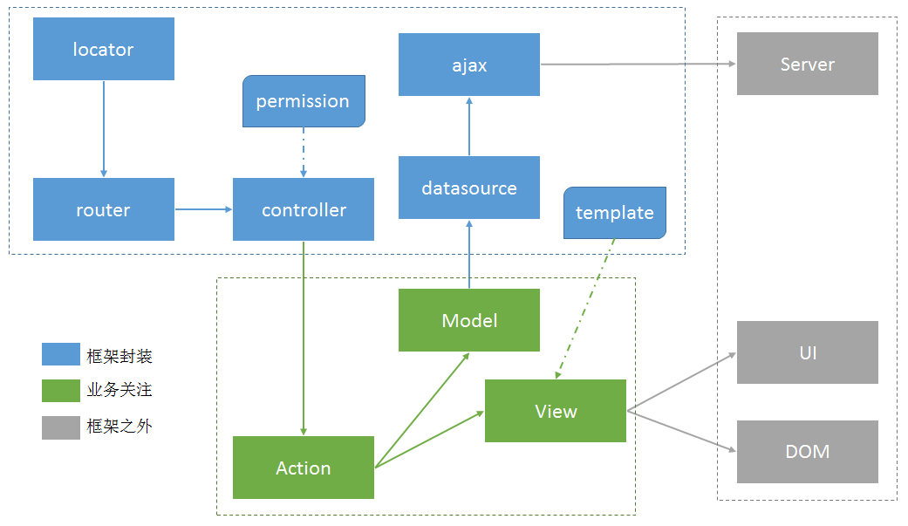

#{{page.title}}

## ER 介绍

ER 是一个富浏览器端web应用的框架，适用于并能很方便地构建一个整站式的AJAX web应用。

ER具有如下特性：

-   通过hash实现路径的管理，支持浏览器的前进和后退功能，以及URL的可访问性。
-   提供精简、核心的Action、Model和View的抽象，使得构建RIA应用变得简单可行。
-   提供可配置式的数据加载方案，提供灵活且完善的数据获取功能。
-   提供支持基本逻辑和数据绑定的模板引擎，提供模板嵌套和母板页。
-   不依赖任何第三方库，模块精简、可切分及独立运行。

ER的目的在于让业务开发工程师可以关注于 **数据（Model）** 、 **业务（Action）** 和 **视图（View）** 这三部分，而不需要关心如 **数据怎么获取** 、 **权限如何管理** 、 **URL如何控制** 等技术性问题。

**以上是复制粘贴，如有雷同，纯属我抄袭。。。**

## locator

### 功能
传统的 ajax 应用中有一个体验比较差的地方就是，内容变，而url不改变，导致浏览器的前进后退，以及 url 的分享传播功能基本无法实现，
而 er 以及很多其他的前端 MVC 框架通过将状态保留在 url 的 hash 字段中来解决这一问题。
当然，如果仅仅支持高级浏览器，则可以用 history api 达到同样的目的。

locator 则是 hash 方案的一种底层实现，支撑着整个 MVC 架构，直接控制着 url 的跳转，只不过是以 hash 的形式做跳转，
与location类似，只是后者是刷新整个页面，前者是局部刷新

### 原理
利用 hashchange 事件实现，不支持 hashchange 的则通过轮训的方式模拟 hashchange， 将 hashchange 包装为 redirect 事件对外提供。

## router

### 功能
将不同的 url 规则映射到对应的功能函数中，对于简单的页面，使用 locator 和 router 即可完成异步化，每个函数就代表了一个业务逻辑。
对于复杂的页面， 通过单独的一个函数处理业务逻辑会导致维护和扩展性的困难，因此业务逻辑会由更高层的 action 模块来完成，
而 action 则由 controller 来调度。 router 则为 controller 提供了底层支持。

### 原理
监听 locator 的 redirect 事件，根据 url 触发符合规则的函数

## controller

### 功能
一种更高层的 router， router 根据 url 调用对应的函数，controller 则根据 url 加载对应的业务逻辑模块（Action），来处理 url 中的请求。

### 原理（执行流程）
1. controller.start
2. router.serBackup注册renderAction，将起始页的 url 丢进去
3. forward 到起始页url对应的 action 中
4. 成功则 enterAction，此后就交给 action 处理逻辑，自己结束此次转发工作，返回。
5. 失败则抛出错误

## Action

### 功能
业务逻辑模块，与Model和View进行交互，负责协调两者来完成一系列的业务逻辑。

### 生命周期
1. enter入口方法进入， 触发 enter 事件
2. createModel 创建数据模型
3. 加载数据
4. fowarToView 处理 view 逻辑
5. 数据加载完毕，触发modelloaded事件
6. createView 创建视图模型
7. 触发beforerender 事件
8. 调用 view 的 render 方法
9. 触发 rendered 事件
10. 调用 initBehavior 方法
11. 触发 entercomplete 事件
12. 操作与交互
13. 调用 leave 方法退出 action
14. 触发 beforeleave 事件
15. 摧毁 model
16. 摧毁 view
17. 触发 leave 事件

## Model

### 功能
数据模型，对数据和数据操作方法的封装

